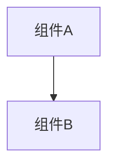
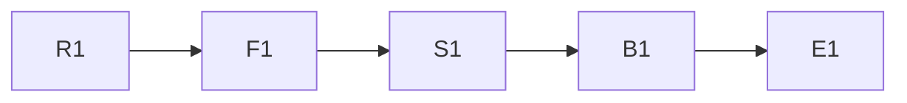

# disclosure 模式输出模板

## 报告结构

```markdown
# MBSE 可专利性分析报告 — <技术主题>

> 生成日期：<YYYY-MM-DD>
> Mode: disclosure
> 输入：<交底书来源>
> 状态：draft / reviewed / agreed

---

## 一、输入材料摘要

| 项目 | 内容 |
|------|------|
| 交底书范围 | … |
| 附图 | … |
| 实施例 | … |
| 背景技术/现有技术 | … |

---

## 二、R/F/S/B/E 节点表

| id | view | node | source | evidence_level | notes |
|----|------|------|--------|---------------|-------|
| R1 | R | … | … | D | … |
| F1 | F | … | … | D | … |

---

## 三、追溯链表

### F功能合同表

| id | system_boundary | input | transformation | output | precondition_or_trigger | allocated_S | realizing_B |
|----|-----------------|-------|----------------|--------|-------------------------|-------------|-------------|
| F1 | … | … | … | … | … | S1 | B1 |

### E效果合同表

| id | affected_object | affected_attribute | consequence | applicable_condition | causal_path | effect_type | comparison_baseline | evidence |
|----|-----------------|--------------------|-------------|----------------------|-------------|-------------|---------------------|----------|
| E1 | … | … | … | … | S1/B1/OutputState→E1 | absolute/comparative | 绝对型可空 | … |

> 若E只是重复F或直接输出，将其移入F表、删除或标Q，不得用同义反复形成闭环。

## 四、追溯链表

| chain_id | R | F | S | B | E | gap_or_question |
|----------|---|---|---|---|---|-----------------|
| C-01 | R1 | F1 | S1 | B1 | E1 | — |

---

## 五、待确认问题表

| question_id | missing_dimension | why_it_matters | requested_confirmation |
|-------------|-------------------|---------------|----------------------|
| Q-01 | B（行为时序） | … | … |

---

## 六、Mermaid 图

### 结构图


### 行为图
```mermaid
sequenceDiagram
    …
```

### 追溯链图


---

## 七、候选创新点表

| innovation_id | R | F | S | B | E | source_support | evidence_level | confidence | inventor_question |
|---------------|---|---|---|---|---|---------------|---------------|-----------|------------------|
| CI-01 | R1 | F1 | S1 | B1 | E1 | … | D | 高 | — |

---

## 七、检索要素 JSON

```json
[
  {
    "innovation_id": "CI-01",
    "innovation_name": "…",
    "technical_problem": "…",
    "technical_solution": "…",
    "technical_effect": "…",
    "evidence_level": "D",
    "search_priority": "高",
    "search_elements": {
      "core_keywords": ["…"],
      "synonyms": ["…"],
      "key_combinations": ["…"],
      "noise_exclusion": ["…"],
      "ipc_candidates": ["…"]
    },
    "novelty_indicators": {
      "differentiation": "…",
      "blank_spot": "待检索验证"
    },
    "related_patents_from_search": []
  }
]
```

---

## 八、（可选）公开资料初筛日志

[阶段四 A：若执行则填充]

## 九、（可选）Google Patents 检索日志

[阶段四 B：若执行则填充]

## 十、（可选）初步新颖性评估表

[阶段四 C：若执行则填充]

---

## 十一、专利证据与论证包

- `patent_evidence_pack.json`：记录 CASE、CLM、CF、REL、DOC、EV、NB、IS 与版本链。
- 本阶段只建立候选 `CLM/CF` 与交底来源证据；新颖性和创造性卡必须在检索与全文核验后填写。
- 每个候选特征组必须指向 R/F/S/B/E 节点或必要关系、原始交底证据和待确认状态。

---

> ⚠️ 本报告为 MBSE 建模辅助输出，不构成专利新颖性或创造性法律结论。
```
