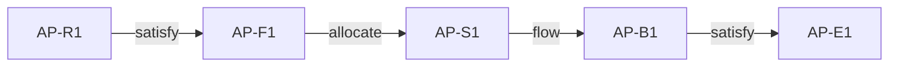

# document 模式输出模板

## 报告结构

```markdown
# 专利文本 MBSE 技术模型报告 — <案件主题>

> 生成日期：<YYYY-MM-DD>
> Mode: document
> 输入文件：<AP / D1 / D2 …>
> 状态：draft / reviewed / agreed

---

## 一、文件登记表

| file_prefix | file_role | version_or_date | source_scope | model_boundary | known_missing_materials |
|-------------|-----------|----------------|--------------|----------------|------------------------|
| AP | 申请文件 | … | 权利要求+说明书+附图 | … | — |
| D1 | 对比文件1 | … | 权利要求+说明书 | … | 附图缺失 |

---

## 二、术语与特征账本

### AP 术语账本

| node_id | original_text | object | action | condition | source | evidence_level | notes |
|---------|--------------|--------|--------|-----------|--------|---------------|-------|
| AP-T1 | … | … | … | … | … | D | … |

### D1 术语账本

[同上格式]

---

## 三、R/F/S/B/E 节点表

### AP 节点表

| id | view | node | source | evidence_level | premise_or_gap |
|----|------|------|--------|---------------|----------------|
| AP-R1 | R | … | 说明书[0008] | D | — |

### D1 节点表

[同上格式，使用 D1 前缀]

---

## 四、双向追溯矩阵

### AP 追溯矩阵

| chain_id | upstream | relation | downstream | source | evidence_level | premise_or_gap |
|----------|----------|----------|-----------|--------|---------------|----------------|
| AP-T01 | AP-R1 | satisfy | AP-F1 | … | D | — |

### D1 追溯矩阵

[同上格式]

---

## 五、接口卡

| interface_id | sender | receiver | object | direction | trigger_or_guard | medium_or_protocol | source | evidence_level |
|-------------|--------|----------|--------|-----------|-----------------|-------------------|--------|---------------|
| AP-IF01 | AP-S1 | AP-S2 | 控制信号 | S1→S2 | 检测到X时 | SPI 总线 | 说明书[0042] | D |

---

## 六、场景/状态表

| scenario | trigger | input_or_state | action | output_or_next_state | source | evidence_level |
|----------|---------|---------------|--------|---------------------|--------|---------------|
| 正常 | … | … | … | … | … | D |
| 异常/失败 | … | … | … | … | … | Q |

---

## 七、Mermaid 图

### AP 追溯链图


### D1 追溯链图
[同上格式]

---

## 八、多文件节点对照总表

| AP 节点 | D1 对应 | D2 对应 | 关系 | 差异说明 |
|---------|---------|---------|------|---------|
| AP-S1 | — | D2-S2' | D1缺失，D2部分对应 | … |

---

## 九、审查员逻辑映射表

| 审查员主张 | 类型 | 对应节点 | 证据核对 |
|-----------|------|---------|---------|
| "D1 公开了…" | 事实认定 | 待定位 | 待核实 |

---

## 十、待核实问题表

| question_id | file_prefix | missing_dimension | why_it_matters | requested_confirmation |
|-------------|-------------|-------------------|---------------|----------------------|
| Q-01 | D1 | S（结构细节） | … | … |

---

## 十一、质量门结果

- [ ] 证据覆盖：每个节点均有来源定位和 D/I/Q/X 标签
- [ ] 追溯链完整性：主链+反向验证链+关系类型+孤立节点处理
- [ ] 接口一致性：跨边界 flow 完整
- [ ] 行为一致性：正常/异常路径分开
- [ ] 文件独立性：对照表未反向修改单文件模型

---

## 十二、专利证据与论证包回写

| 项目 | 包内 ID | 输入/输出 | 状态 | 说明 |
|------|---------|-----------|------|------|
| 当前权利要求版本 | CLM-… | 输入 | … | … |
| 区别特征组 | CF-… | 输入/更新 | D/I/Q/X | … |
| 对比文件证据 | DOC/EV-… | 更新 | D/I/Q/X | … |
| 新颖性判断卡 | NB-… | 复核 | draft/reviewed/agreed | 单文献限定 |
| 创造性判断卡 | IS-… | 更新 | draft/reviewed/agreed | 三步法与组合分析 |

`document` 模式仅使用 D/I/Q/X 事实状态；不得将发明人确认新增的 N 状态写入对比文件或审查意见事实。

---

> ⚠️ 本报告为 MBSE 技术建模辅助输出，不构成新颖性、创造性或侵权的法律结论。
> 若追溯链完整性未通过，本报告标题标注「未完成模型」，不得输出为完成版。
```
